# RAG Notebook

Author: Mihai Criveti
Description: Simple RAG example notebook

## Usage

```
jupyter lab
```

## Sample API and UI

```
uvicorn api:app --reload
streamlit run ui.py
```

## Architecture

```mermaid
flowchart TB
    %% Configuration
    subgraph Config ["⚙️ System Configuration"]
        direction TB
        CF["🔧 Feature Flags & Config<br/>Uses: python-dotenv"]
    end

    %% Input
    subgraph Input ["🌐 Source Ingestion"]
        direction TB
        A["📤 Files & URLs<br/>Upload PDFs"]
        UP["📤 /upload-pdf<br/>Upload and Ingest PDFs"]
        A --> UP
    end

    %% Processing
    subgraph Processing ["⚙️ Content Processing"]
        direction TB
        C["🔄 Extraction Pipeline<br/>Document Parsing<br/>Uses: PyPDF2"]
        E["✂️ Content Chunking<br/>Quality Validation<br/>Uses: Custom Python Functions"]
        C --> E
    end

    %% Query
    subgraph Query ["🔎 Query Processing"]
        direction TB
        Q["💬 Query Matching<br/>Retrieve Relevant Chunks<br/>Uses: ChromaDB"]
        R["🧠 LLM Response<br/>Generate Answer<br/>Uses: Ollama (local) / ChatGPT (API)"]
        QP["🔎 /query<br/>Query PDFs and Retrieve Results"]
        Q --> R
        Q --> QP
    end

    %% Models
    subgraph Models ["🤖 AI Models"]
        direction TB
        M1["📚 Embedding Models<br/>Uses: ChromaDB for Embeddings"]
        M2["🧪 LLM Models<br/>Uses: Ollama / ChatGPT"]
    end

    %% Storage
    subgraph Storage ["💾 Storage Architecture"]
        direction TB
        S3["📁 Object Storage<br/>Raw Documents<br/>Uses: Local Storage"]
        S4["🗄️ ChromaDB Vector Store<br/>Embeddings Index"]
    end

    %% UI
    subgraph UI ["🖥️ User Interface"]
        direction TB
        UI1["🌐 Web Dashboard<br/>Upload & Query PDFs<br/>Uses: Streamlit"]
    end

    %% Connections
    Config --> Input
    Config --> Processing
    Config --> Models

    Input --> Processing
    Processing --> Storage

    Models --> Processing

    Query --> Processing
    Query --> Storage
    Query --> Models

    UI --> Input
    UI --> Query

    %% Styling
    classDef configStyle fill:#f9d5e5,stroke:#333,stroke-width:2px
    classDef inputStyle fill:#d4f1f9,stroke:#333,stroke-width:2px
    classDef processStyle fill:#d5e8d4,stroke:#333,stroke-width:2px
    classDef queryStyle fill:#fce4d6,stroke:#333,stroke-width:2px
    classDef modelStyle fill:#e1d5e7,stroke:#333,stroke-width:2px
    classDef storageStyle fill:#fff2cc,stroke:#333,stroke-width:2px
    classDef uiStyle fill:#cfe2f3,stroke:#333,stroke-width:2px

    class Config,CF configStyle
    class Input,A,UP inputStyle
    class Processing,C,E processStyle
    class Query,Q,R,QP queryStyle
    class Models,M1,M2 modelStyle
    class Storage,S3,S4 storageStyle
    class UI,UI1 uiStyle
```


